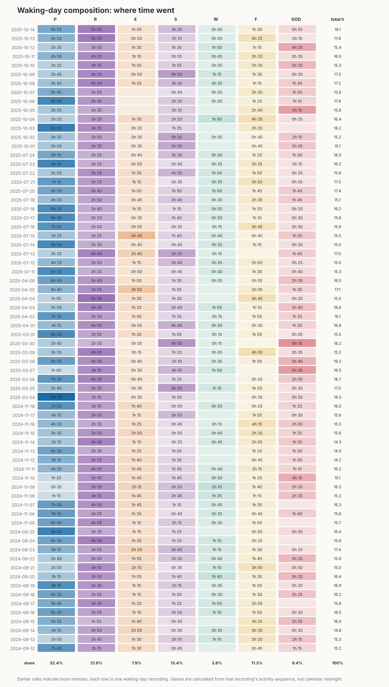
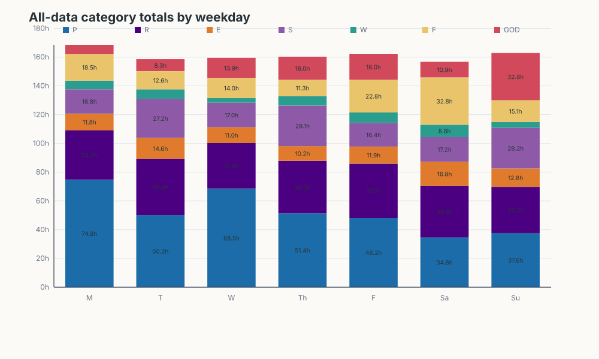
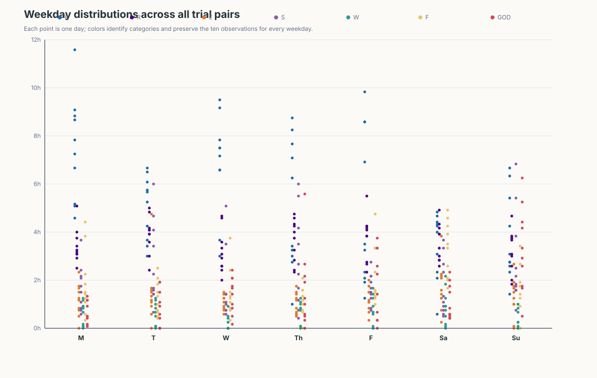

## **Part 2: Problem Framing & Analytic Tasks**

**Why It’s a Good Visualization Problem**

The log contains 70 waking-day recordings across five 14-day trial pairs. Each recording is a sequence of activities whose durations are calculated from adjacent timestamps, so ordinary means can hide timing, composition, weekday effects, and tradeoffs between categories. The data are also compositional: more time in one category can leave less available for another. A visual interface is therefore needed to compare many categories across time while preserving the waking-day definition rather than treating midnight as a boundary.

**Three Core Analytic Tasks**

* **Task 1 (Composition / Trend):** Compare how Productive, Routine, Eat, Social, Workout, Fun, and God time are allocated across all waking-day recordings.
* **Task 2 (Categorical Comparison):** Compare weekday patterns and seven-day period totals while preserving variation across the five trial pairs.
* **Task 3 (Relationship / Tradeoff):** Identify whether an above-average total in one category coincides with a below-average total in another, while accounting for total recorded time.

## **Part 3 & 4: Visualization Portfolio & Critiques**

### **1\. Waking-Day Composition Heatmap**

* **Target Task:** Task 1, composition and trend.

* **Rationale & Critique:** This heatmap keeps all 70 waking-day recordings in chronological order and places the seven categories in stable columns. Each cell shows the exact duration while opacity supports rapid scanning, so the reader can see both small recurring activities and large changes in Productive or Fun time without estimating bar lengths. The additional total-hours column distinguishes a genuinely different composition from a day with simply more recorded activity. The percentage row at the bottom summarizes how the entire dataset’s recorded time is distributed across categories. Routine uses indigo, giving it a distinct visual identity from the other categories. The chart’s important semantic choice is that every row comes from one waking-day recording: durations are calculated from that day’s activity sequence, not from literal calendar-day boundaries. The main limitation is vertical density. Seventy rows require a tall display, and color intensity is less precise than the printed minute values. The exact labels and total column mitigate that limitation, while the chart remains useful for locating clusters, gaps, and unusually composition-heavy days.

### **2\. All-Data Category Totals by Weekday**

* **Target Task:** Task 2, categorical comparison.

* **Rationale & Critique:** This stacked bar chart aggregates the ten occurrences of each weekday and shows the total minutes for all seven categories. Each segment is labeled in hours, so the viewer can read both the overall weekday total and the contribution of each category without relying only on color. The chart highlights broad behavioral differences: weekdays can be compared as complete compositions, while the stable category order makes the stacks easy to scan. It complements the heatmap by reducing 70 rows to seven grouped summaries. Stacking is appropriate for the total-time question, though segments away from the baseline are less accurate for precise cross-weekday comparison. The labels and consistent colors reduce that perceptual cost. This chart should not be interpreted as seven independent correlation observations; each weekday total is an aggregate of ten days and discards trial-pair variation. Its strength is descriptive comparison of typical weekday allocation, not causal inference.

### **3\. Flawed Visualization Example: Weekday Category Strip Plot**

* **Target Task:** Task 2, weekday distribution comparison.

* **Rationale & Critique:** This chart attempts to show every category observation for each weekday, but it is a poor final presentation because seven categories are compressed into a single dense panel. The colors are numerous and similar in visual weight, so category identity becomes difficult to follow across the weekday bands. The small point offsets and large number of overlapping marks also make individual values hard to compare, especially for categories with similar totals. Its fixed vertical scale forces low-minute observations near the baseline while high-minute observations dominate the available space. The result is technically complete but perceptually noisy: the viewer must decode a legend, locate a tiny point, and mentally compare positions across crowded weekday groups. The chart also spends substantial canvas area on seven categories without providing category-specific scales or small multiples. A better design would facet one category per panel, use a restrained palette, and add medians or interval summaries. This example is useful as a critique because it demonstrates that retaining all observations is not enough; color count, mark size, and layout must support interpretation.

